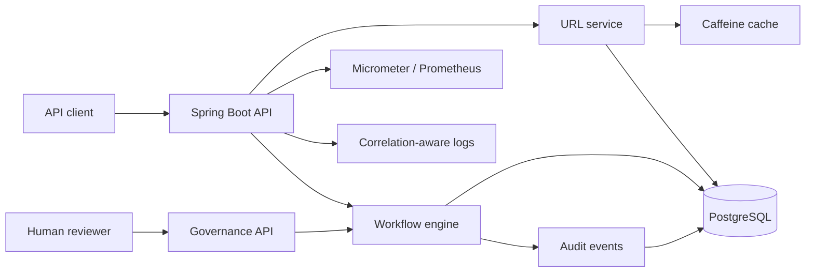
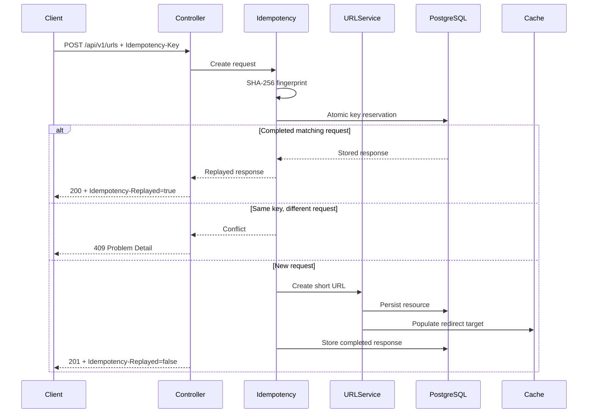
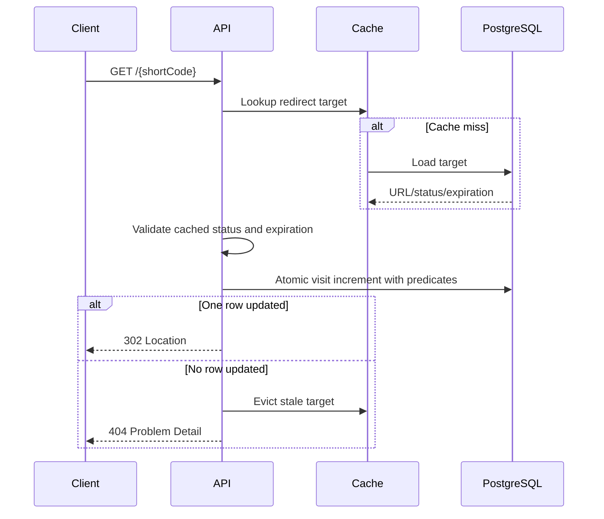
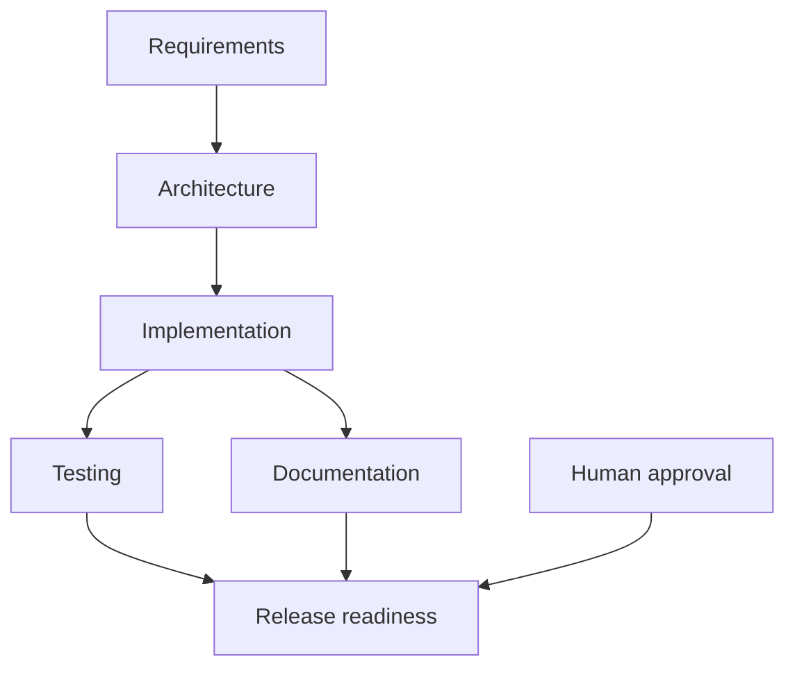

# Architecture

## 1. Purpose

The system combines two concerns:

1. A production-oriented URL-shortening service.
2. A governed agentic SDLC workflow prototype.

The URL shortener provides a realistic engineering workload involving APIs,
persistence, concurrency, idempotency, caching, analytics, observability, and
operational packaging.

The orchestration module demonstrates how multi-step engineering work can be
executed under explicit dependencies, human oversight, and safety controls.

## 2. System context



## 3. Major components

### URL module

Responsibilities:

- Validate destination URLs.
- Normalize URLs for comparison.
- Generate secure Base62 short codes.
- Persist short URLs.
- Resolve redirects.
- Record redirect analytics.
- Return API metadata.

### Idempotency module

Responsibilities:

- Validate the client’s idempotency key.
- Create a SHA-256 request fingerprint.
- Atomically reserve the key.
- Detect conflicting payloads.
- Store completed responses.
- Replay completed operations.
- Track failed and in-progress operations.

### Cache module

Responsibilities:

- Cache immutable redirect lookup data.
- Avoid caching JPA entities.
- Evict expired or unavailable entries.
- Reduce database reads on the redirect path.

Every successful redirect still uses an atomic database update to record the
visit. The update checks status and expiration, protecting against stale cache
entries.

### Orchestration module

Responsibilities:

- Persist workflows and workflow nodes.
- Model an explicit dependency graph.
- Unlock nodes after dependencies complete.
- Support sequential and parallel stages.
- Synchronize testing and documentation before release.
- Invalidate downstream work during re-planning.
- Enforce workflow state transitions.

### Governance module

Responsibilities:

- Require human approval before release readiness.
- Record approval actor and rationale.
- Safe-stop workflow execution.
- Store append-only audit events.
- Reject execution against stopped or completed workflows.

### Observability module

Responsibilities:

- Propagate or generate correlation IDs.
- Record URL creation and redirect metrics.
- Record redirect duration.
- Expose health and Prometheus endpoints.

## 4. URL creation flow



## 5. Idempotency design

### State model

```text
IN_PROGRESS -> COMPLETED
IN_PROGRESS -> FAILED
FAILED      -> IN_PROGRESS
expired     -> IN_PROGRESS
```

### Request fingerprint

The canonical fingerprint contains:

```text
trimmed URL + newline + canonical expiration timestamp
```

It is hashed using SHA-256.

The same key with a different fingerprint returns `409 Conflict`.

### Atomic reservation

The reservation uses:

```sql
INSERT ... ON CONFLICT DO NOTHING
```

The database primary key is the final concurrency boundary. This works across
multiple application instances without relying on process-local locks.

### Transaction boundaries

The reservation is committed independently so concurrent requests can observe
ownership.

URL creation and idempotency completion participate in the application
transaction. Failed execution is marked through a separate transaction so it
can be retried safely.

### Failure behavior

| Failure | Behavior |
|---|---|
| Duplicate matching completed request | Replay response |
| Duplicate mismatched request | Reject with `409` |
| Concurrent in-progress request | Reject with retryable `409` |
| Application failure | Mark record failed |
| Process crash | Leave reservation in progress until expiration |
| Expired incomplete reservation | Allow controlled retry |

## 6. Redirect and analytics flow



The atomic visit update prevents lost increments and protects against an entry
being disabled or expiring between cache lookup and database access.

## 7. Workflow dependency graph



Testing and documentation can proceed in parallel. Release readiness is
unlocked only when:

- Testing is complete.
- Documentation is complete.
- Human approval exists.

## 8. Workflow state model

### Workflow states

```text
PLANNED
RUNNING
COMPLETED
FAILED
SAFE_STOPPED
```

### Node states

```text
BLOCKED
READY
RUNNING
COMPLETED
INVALIDATED
```

A node becomes `READY` only when all prerequisites are `COMPLETED`.

Optimistic-lock version columns prevent silent overwrites when concurrent
requests update the same workflow or node.

## 9. Re-planning

When an upstream node changes:

1. The changed node is invalidated.
2. Its previous output is cleared.
3. The changed node becomes ready again.
4. All transitive downstream nodes return to blocked state.
5. Downstream outputs are cleared.
6. The workflow revision increments.
7. Unaffected upstream work remains complete.

This preserves completed work that is not affected by the changed decision.

## 10. Governance

### Release approval

Release readiness is a high-impact transition and remains blocked until a human
reviewer provides:

- Actor identity.
- Approval rationale.
- Timestamp.

### Safe stop

A human may safe-stop a workflow. Execution and re-planning attempts against a
safe-stopped workflow return `409 Conflict`.

Safe-stop is intentionally different from failure:

- Failure indicates unsuccessful execution.
- Safe-stop indicates a deliberate governance decision.

### Audit trail

Audit events are append-only and contain:

- Workflow ID.
- Event type.
- Actor.
- Details or rationale.
- Timestamp.

Current key events include:

```text
WORKFLOW_CREATED
RELEASE_APPROVED
WORKFLOW_SAFE_STOPPED
```

## 11. Required scenarios

### Greenfield scenario

Example requirement:

```text
Create a new short-URL expiration capability.
```

Execution:

1. Normalize expiration behavior and timezone assumptions.
2. Design schema and API changes.
3. Implement domain and persistence changes.
4. Run testing and documentation in parallel.
5. Require release approval.
6. Complete release readiness.

Validation:

- Future timestamps accepted.
- Past timestamps rejected.
- Expired links return `404`.
- UTC clock behavior is deterministic.

### Brownfield scenario

Example requirement:

```text
Add redirect analytics without harming redirect reliability.
```

Execution:

1. Inspect the redirect path and persistence model.
2. Select an atomic database counter.
3. Add cache-aside lookup.
4. Test cached and uncached redirects.
5. Document consistency trade-offs.
6. Require release approval.

Validation:

- Concurrent updates do not lose visits.
- Expired cached links do not redirect.
- Cache misses load from PostgreSQL.
- Metrics expose redirect outcomes.

### Ambiguous scenario

Example requirement:

```text
Support custom short aliases.
```

Ambiguities:

- Who may reserve an alias?
- Are aliases case-sensitive?
- Can aliases be changed or reused?
- Which words are reserved?
- What happens after expiration?
- Does the feature require authentication?

Governed handling:

1. Requirements node records unanswered questions.
2. Workflow does not assume security-sensitive behavior.
3. Human clarification is requested.
4. Downstream design remains blocked.
5. Safe-stop is available if risk cannot be resolved.
6. Re-planning invalidates downstream work after clarification.

This demonstrates controlled autonomy rather than silently choosing product or
security policy.

## 12. Data model

Primary tables:

| Table | Purpose |
|---|---|
| `short_urls` | URL resource and analytics |
| `idempotency_records` | Durable request ownership and response replay |
| `workflows` | Workflow aggregate |
| `workflow_nodes` | Stateful SDLC stages |
| `workflow_dependencies` | Explicit DAG edges |
| `workflow_approvals` | Human release approvals |
| `workflow_audit_events` | Append-only governance history |

All schema evolution is handled through Flyway. Hibernate validates but does not
create production tables.

## 13. Security considerations

Implemented:

- HTTP/HTTPS allowlist.
- Embedded-credential rejection.
- Input-length validation.
- Database constraints.
- Problem Details without stack traces.
- Environment-based credentials.
- Non-root runtime container.
- Correlation-ID validation.
- Explicit governance controls.

Required before public production exposure:

- Authentication.
- Client authorization.
- Rate limiting.
- Abuse detection.
- Network restrictions around actuator endpoints.
- Secret-management integration.
- URL reputation and phishing controls.
- Administrative authorization for governance actions.

## 14. Scalability

### Application tier

The service is stateless except for local redirect cache entries. Durable state
resides in PostgreSQL, allowing multiple application instances.

### Cache

Caffeine is per-instance. Cache misses are safe because PostgreSQL is the source
of truth.

A distributed cache may be introduced if cross-instance hit rate becomes
important.

### Database

Important constraints and indexes support:

- Short-code lookup.
- Idempotency-key reservation.
- Expiration queries.
- Workflow status lookup.
- Dependency traversal.
- Audit-event retrieval.

### Analytics

Visit increments are atomic but synchronous. At very high traffic, analytics
could move to an event stream and asynchronous aggregation.

## 15. Reliability and failure handling

| Risk | Current control |
|---|---|
| Duplicate client request | Durable idempotency |
| Key reused for another operation | Request fingerprint conflict |
| Concurrent key reservation | PostgreSQL uniqueness |
| Short-code collision | Bounded generation retry and uniqueness |
| Stale cached redirect | Predicate-based database update and eviction |
| Concurrent workflow update | Optimistic locking |
| Premature release | Human approval gate |
| Unsafe execution | Safe-stop |
| Lost decision history | Append-only audit events |
| Schema drift | Flyway validation and Hibernate validation |

## 16. Observability

The service provides:

- Correlation-aware logging.
- Health, readiness, and liveness probes.
- Prometheus metrics.
- URL creation counts.
- Redirect success/failure counts.
- Redirect-duration timers.
- Persistent workflow audit events.

Future orchestration metrics should include:

- Workflow success rate.
- Retry frequency.
- Rollback frequency.
- Mean time to recovery.
- End-to-end workflow duration.

## 17. CI and release readiness

GitHub Actions performs:

1. Repository checkout.
2. Java 21 setup and Maven caching.
3. PostgreSQL service provisioning.
4. Flyway migration and schema validation.
5. Maven test and verification lifecycle.
6. Test-report and JAR upload.
7. Production container build verification.

The Docker runtime:

- Uses a Java 21 JRE.
- Contains no build tool.
- Runs as a non-root user.
- Uses container-aware JVM memory settings.

## 18. Trade-offs

### PostgreSQL idempotency instead of Redis

Advantages:

- Strong transactional behavior.
- Fewer infrastructure components.
- Durable replay.

Trade-off:

- Higher write load on the primary database.

### Local cache instead of distributed cache

Advantages:

- Simple failure model.
- No network dependency on redirect lookup.
- Low operational cost.

Trade-off:

- Cache entries are not shared across instances.

### Fixed SDLC graph

Advantages:

- Deterministic and reviewable.
- Easy to demonstrate and audit.
- Explicit parallel and synchronization behavior.

Trade-off:

- Workflow definitions are not yet user-configurable.

### Synchronous analytics

Advantages:

- Immediately consistent visit counts.
- Simple implementation.

Trade-off:

- Database update occurs on the redirect path.

## 19. Limitations and next steps

Not implemented:

- Automated retry policies.
- Compensating rollback execution.
- Workflow resume after safe-stop.
- Authentication and role-based governance.
- Automated idempotency cleanup.
- Distributed redirect cache.
- External AI-agent execution.
- Configurable workflow definitions.
- Complete audit coverage for every node transition.
- Full orchestration reliability metrics.

These limitations are explicit so the prototype does not overstate its current
production readiness.